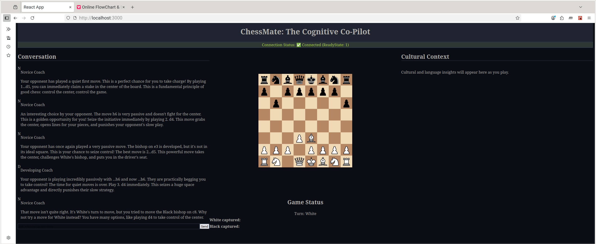
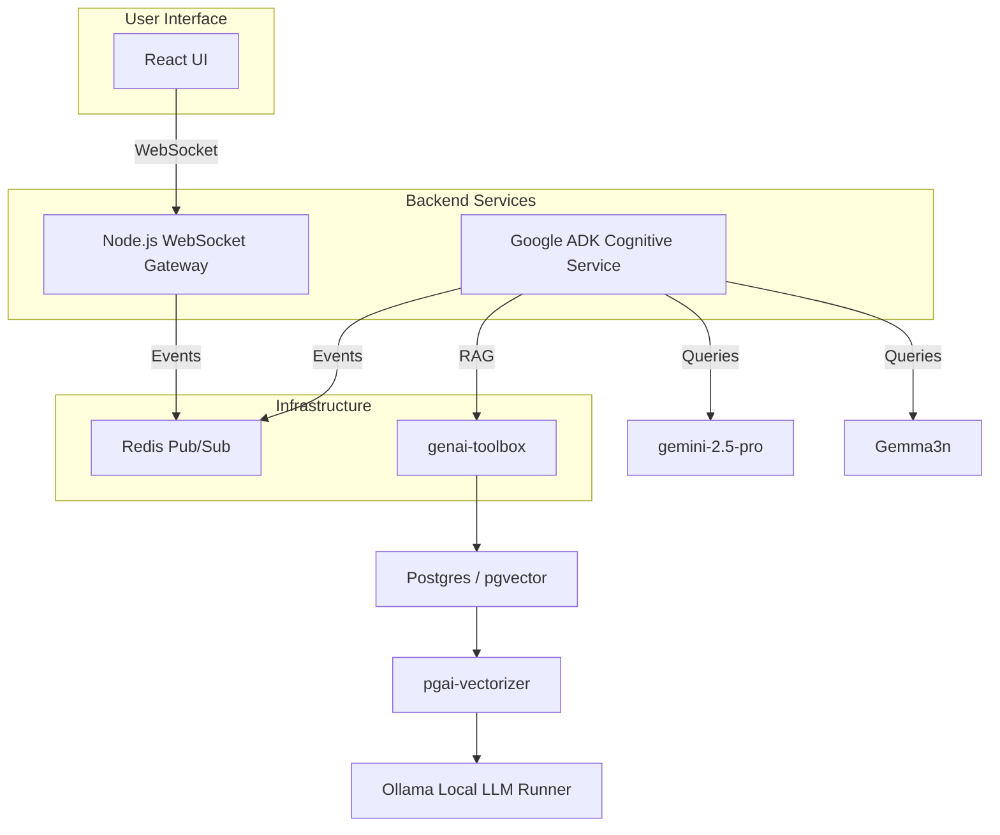

# ChessMate: The Cognitive Co-Pilot

**ChessMate** is an AI-powered cognitive co-pilot that transforms chess into a dynamic language learning experience. It provides personalized coaching that adapts to the user's cognitive stage and linguistic proficiency, making learning both engaging and effective.

### Why ChessMate Matters

Traditional learning often lacks context. ChessMate solves this by merging the universal appeal of chess with adaptive AI, creating a unique platform where users can master a new language through strategic gameplay. For stakeholders, this project demonstrates a powerful, real-world application of AI in personalized education.

---

## 🚀 Quick Start

To get your local development environment up and running, please follow our detailed quick start guide:

**➡️ [ChessMate Quick Start Guide](docs/105-001-chessmate-quickstart-au.md)**

---

## 🏛️ Architecture & Technical Foundation

ChessMate is built on a modern microservice architecture, ensuring scalability and maintainability. The system is fully containerized with Docker for consistent development and deployment.

### Core Technologies

*   **Frontend:** React with Vite, styled with Tailwind CSS and Shadcn UI.
*   **Backend:**
    *   **WebSocket Gateway:** A Node.js service for real-time, bidirectional communication.
    *   **Cognitive Service:** A Python service built with the **Google ADK (Agent Development Kit)** that houses our multi-agent AI system.
*   **AI & Data:**
    *   **LLMs:** A hybrid model approach featuring:
        *   **`gemini-2.5-pro`:** For high-level reasoning, orchestration, and multilingual communication.
        *   **`Gemma3n` & other local models:** Running via **Ollama** for specialized tasks, privacy, and offline capabilities.
    *   **RAG Pipeline:**
        *   **`genai-toolbox`:** Manages Retrieval-Augmented Generation, connecting our AI to a specialized knowledge base.
        *   **`Postgres / pgvector`:** Serves as the vector database for storing and querying chess literature.
        *   **`pgai-vectorizer`:** A dedicated service for generating the embeddings needed for our RAG pipeline.

---

## 🔄 Core Concept: The Coaching Loop

The system operates on a simple, event-driven loop that provides real-time coaching to the user.

1.  **User Moves:** The user makes a move on the React frontend.
2.  **Event Published:** The move is sent to the Node.js gateway, which publishes it to the Redis event bus.
3.  **AI Analysis:** The Python Cognitive Service consumes the event, analyzes the move using its multi-agent system, and generates a structured `CoachingPayload`.
4.  **Feedback Delivered:** The coaching payload is published back to the event bus and delivered to the user's UI in their chosen language.

---

## 📍 Current Status & Roadmap

The project is currently in a stable, functional state, with the end-to-end coaching loop fully operational.

### Next Steps

*   **Phase 1: UI Polish:** Complete the implementation of all UI panels to fully render the rich `CoachingPayload` data.
*   **Phase 2: RAG Expansion:** Continue to expand the RAG knowledge base with more chess strategies and cultural contexts.
*   **Phase 3: User Interaction:** Implement the user chat feature, allowing for interactive follow-up questions with the AI coach.
